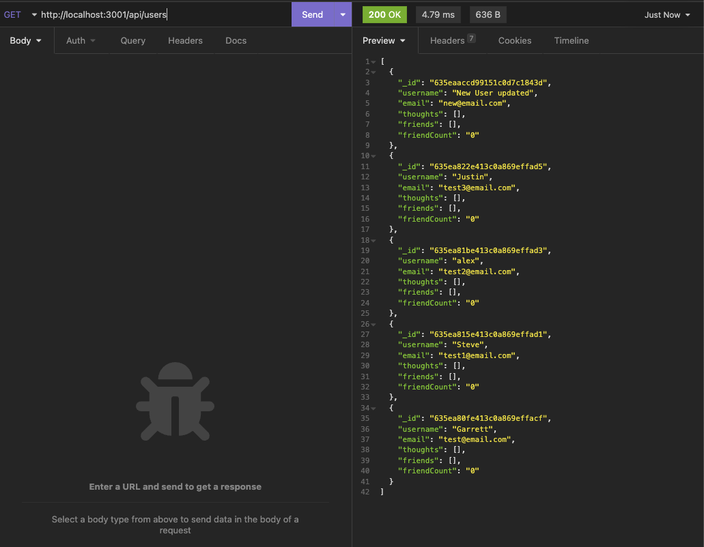
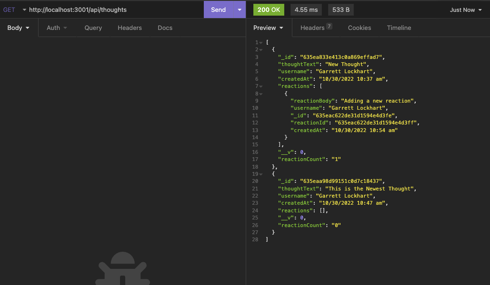
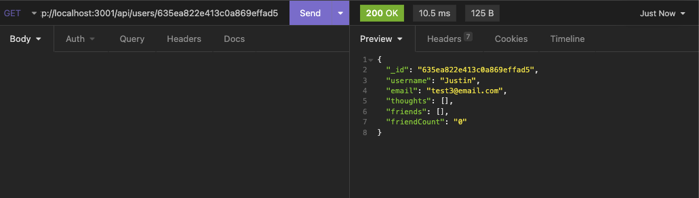
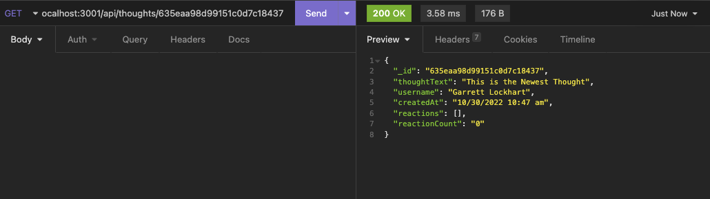
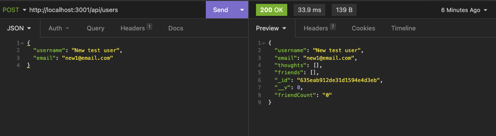
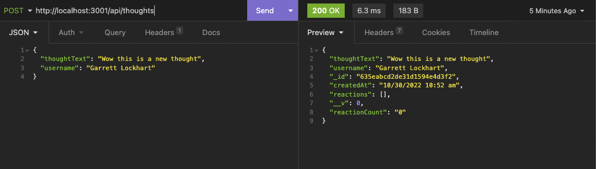
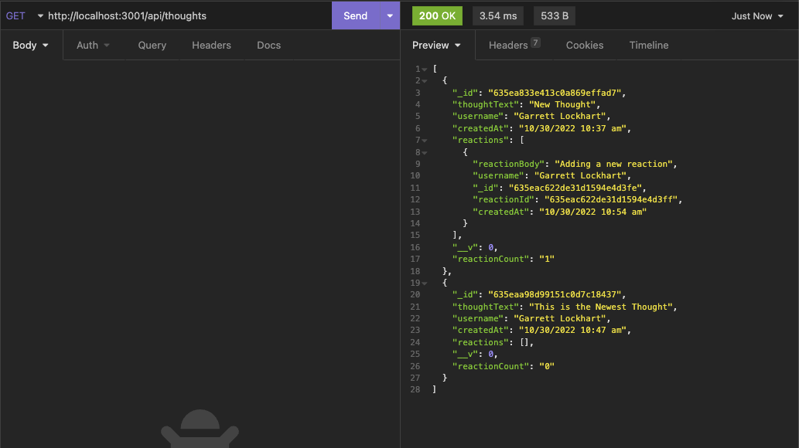
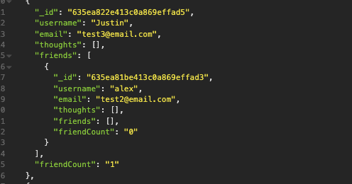

<!-- https://github.com/othneildrew/Best-README-Template -->

<!-- PROJECT LOGO -->
 

  

<h3 align="center">Social Network API</h3>

  

    The API for a basic social network app.
     
     
     
    <a href="https://github.com/GarrettLockhart/social-network-api/issues">Report Bug</a>
    ·
    <a href="https://github.com/GarrettLockhart/social-network-api/issues">Request Feature</a>
  

 
 
 

<!-- TABLE OF CONTENTS -->

  
Table of Contents

  <ol>
    <li>
      <a href="#about-the-project">About The Project</a>
        <li><a href="#built-with">Built With</a></li>
    </li>
    <li><a href="#live-site">Live Site</a></li>
  </ol>

 

<!-- ABOUT THE PROJECT -->

## About The Project

This project was built using node.js, express.js, MongoDB, and mongoose. All routes are set up using express and the mongoose as an ODM. You can run all CRUD operation, like adding users, adding thoughts, adding reactions to thoughts, adding friends to a users friends list, removing users from a friends list, delete users, delete thoughts, update users, update thoughts. It also uses MongoDB schema's and models for the document entered into the database.

### Built With

- [MongoDB](https://www.mongodb.com/)
- [node.js](https://nodejs.org/en/)
- [Express.js](https://expressjs.com/)
- [mongoose](https://www.npmjs.com/package/mongoose)
- [dayjs](https://www.npmjs.com/package/dayjs)

 

## Installation instructions

See the video linked below for a full walk-through of all CRUD operations.

 
 
 

<!-- CONTRIBUTING -->

## Contributing

Any contributions you make are **greatly appreciated**.

If you have a suggestion that would make this better, please fork the repo and create a pull request. You can also simply open an issue with the tag "enhancement".
Don't forget to give the project a star! Thanks again!

1. Fork the Project
2. Create your Feature Branch (`git checkout -b feature/AmazingFeature`)
3. Commit your Changes (`git commit -m 'Add some AmazingFeature'`)
4. Push to the Branch (`git push origin feature/AmazingFeature`)
5. Open a Pull Request

<!-- CONTACT -->

 
 

## Demo Screenshot and Video Walk through

A walk through video of the application <a href="https://drive.google.com/file/d/1sJREmcXqpYTe3PwQ2mL3FlvxByafYxtv/view">here.</a>

 

 

 

 

 

 

 

 

(<a href="#top">back to top</a>)

